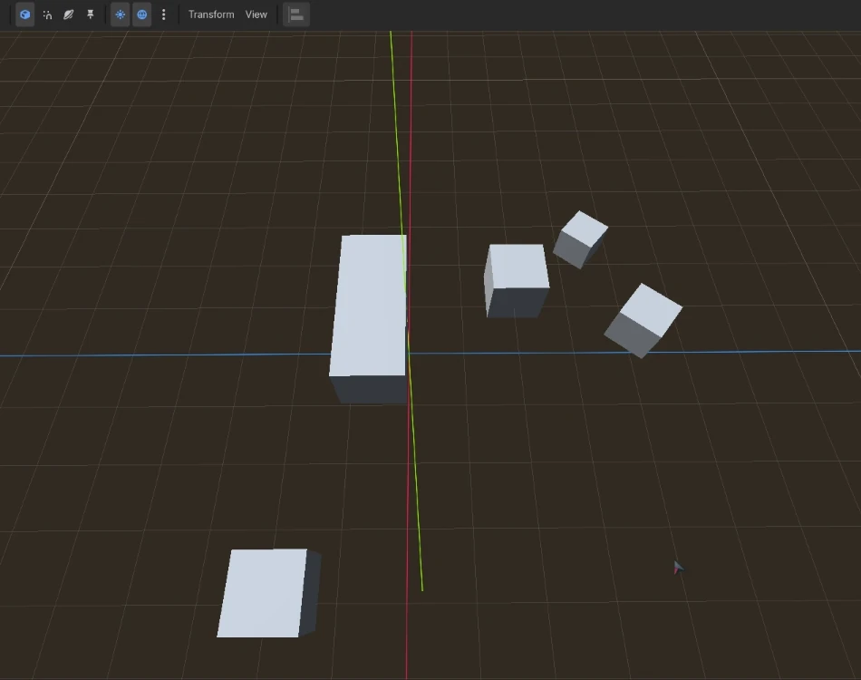

# Godot Align Tool

A Godot plugin for aligning nodes, based on [zaevi's Godot Alignment Tool](https://github.com/zaevi/godot-alignment-tool).

Features:
- Supports 3D, 2D and Control nodes
- Supports nested, scaled and sizeless nodes
- Distribute nodes by equal gap
- Distribute nodes by equal center distance
- Align in global space or in local space
- Align to overall bounding box or to active (last selected) item

[Picture 1](assets/align_and_distribute.png) | [Picture 2](assets/supports_local_space.png) | [Picture 3](assets/align_to_item.png)

## Installation

Install it via the [Godot Asset Store](https://store.godotengine.org/asset/riskozs/godot-align-tool/), or download this repo and put the `align-tool` folder into `<YOUR_PROJECT>/addons/`.

Don't forget to activate the plugin in `Project > Project Settings > Plugins`.
